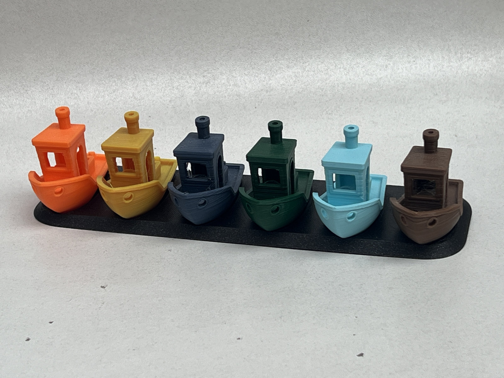
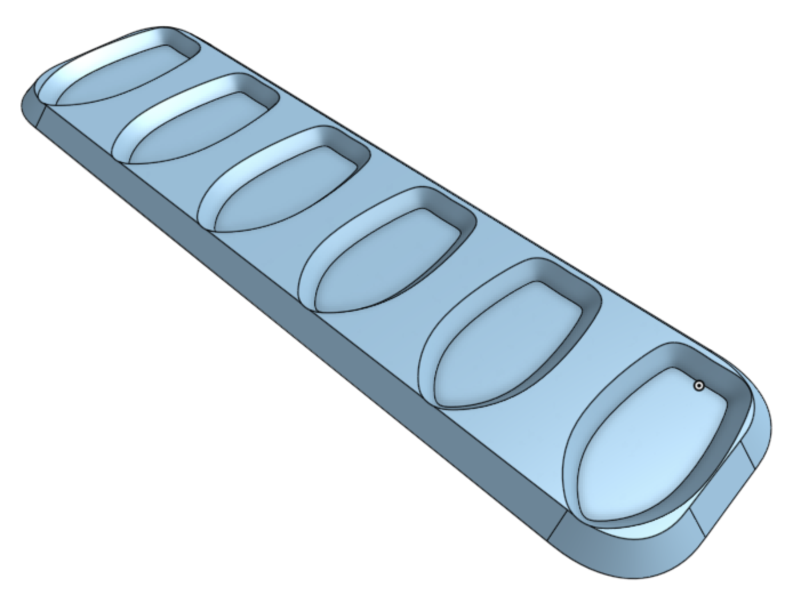

# Benchy base display

Many people use the [3DBenchy 3D model](https://www.3dbenchy.com/) as a way to calibrate a 3D printer or test a new filament.

If you end up with a number of benchies, you might want to organise or display them.

This model is carefully designed to display six benchies. It requires little filament and prints quickly without supports. 

Download this model today and display your Benchies!

<https://www.printables.com/model/796274-benchy-base-display>

## License

CC0

## Author

Leon Brocard <acme@astray.com>
